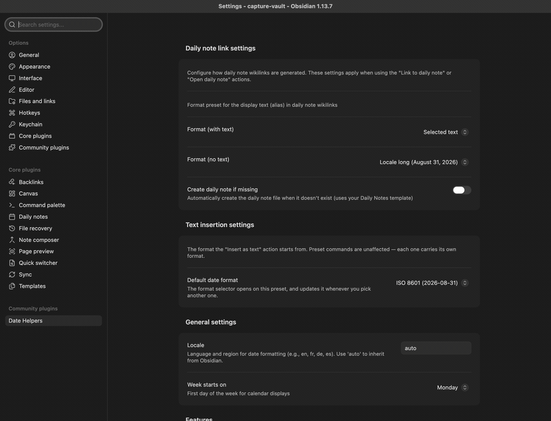

# Date Helpers

An Obsidian plugin for effortlessly managing the dates that interrupt your writing.
This plugin facilitates the insertion of dates you count on your fingers, look up in a calendar, or wrap in wikilink brackets by hand. It brings a **date picker**, **format presets** (eleven of them to start with, plus the ones you write yourself) and **daily note links**.
The picker and the suggestion popup open on a trigger you type, without leaving the line.

You are mid-sentence and a date gets in the way: *next monday* — which date is that, again?
Type `@next monday`, press `Enter`, and the date lands in the format you chose, as text or as a link to that day's note.

*Typing `@next monday`: the popup reparses on every keystroke; pick the format you want, and `Enter` replaces the whole expression.*

 

Writing `[[Journal/2026-08-17|kickoff meeting]]` by hand, pipe and all, is the other chore. Select your words, type `@@`, pick a day. Your words become the link's alias, in a field you can edit before inserting.

*Selecting your words, typing `@@`, then trimming the alias before confirming: the link carries the text you edited, brackets and pipe included.*

 

> **New to Obsidian?**
>
> A **daily note** is the one-note-per-day journal of a core plugin, and a **wikilink** like `[[2026-08-17|kickoff meeting]]` is a link that shows an alias (`kickoff meeting`) instead of its target (`2026-08-17`). Date Helpers writes both for you.

## Installation

Date Helpers needs Obsidian **1.13.0** or later.

1. Open **Settings → Community Plugins → Browse**, search for `Date Helpers`, install and enable.
2. Open any note and type `@next monday`. The popup lists what it can insert; `Enter` replaces the whole expression with the date, `Esc` dismisses.
3. Prefer a calendar? Type `@@` for the full picker.

BRAT and manual installation are covered in the [User Guide](./docs/USER_GUIDE.md#installation).

## What Date Helpers takes over

Four chores, all without leaving the keyboard:

- **the mental calendar** — type `next monday` in any of six languages and get the date, computed for you
- **the format** — that date rendered in the preset you choose, `2026-08-17` or `August 17, 2026`, or in a format you wrote yourself
- **the link syntax** — your own words kept as a daily note link's alias, brackets and pipe written for you
- **the lookup** — a date picker, on the default `@@` trigger or from the command palette, for the days you would rather see than name

### The full picker

*Typing `@@` opens the picker; pick another format if you want, then confirm — the trigger becomes the date.*

 

Some days you would rather point at than phrase. `@@` — a trigger set by default — opens the picker: an expression field, three icon buttons that choose what confirming does, a calendar, and a format selector.

The three actions:

- **Insert as text** — `2026-08-17`, or `August 17, 2026`, whichever preset you pick
- **Link to daily note** — `[[Journal/2026-08-17|August 17, 2026]]`
- **Open daily note** — the daily note itself, opened, and created first if you enabled that

On **Link to daily note**, once there are words to carry — a selection, or what you typed in the expression field — the footer adds an **editable alias field**: the words the link will show stay yours to rewrite until you confirm.

Triggers are yours to shape: each one declares whether it opens the picker or the popup, so a one-character `;` can open the picker and a three-character `//d` the popup.

**No trigger fires in the middle of a word**, so `any.pattern@` stays an email address while `@` is a trigger.

There is also one command per format preset — **Insert date: ISO 8601**, for instance — which inserts straight away without opening anything. One caveat: these commands follow the picker's last action, so right after **Link to daily note** they write a wikilink, not plain text — until the picker stands on **Insert as text** again.

The [User Guide](./docs/USER_GUIDE.md#core-workflows) walks through each workflow, capture by capture.

### Type `@` and keep typing — the inline popup

`@` — the other trigger set by default — opens a suggestion popup, and everything after it is reparsed on every keystroke, spaces included, so `@next monday at 2pm` works. The popup groups what it can insert: the formats you picked for it (`ISO 8601` and `Locale long` out of the box), and a link to that day's daily note.

`Enter` inserts. `Esc` dismisses. `Tab` opens the picker, and so does the footer's **Open the picker…** action. One undo restores what you typed, however long it was.

When nothing parses, the popup still offers the daily note link and the picker — **your words become the link's alias** rather than being discarded.

Adding triggers and choosing what the popup lists: [Trigger characters](./docs/USER_GUIDE.md#trigger-characters) in the guide.

### Your selection becomes the alias

Select `kickoff meeting`, type the `@` trigger, then pick a preset or keep typing a natural-language date. The popup offers a wikilink that points at the daily note of that date and carries your selected words as its alias.

*Selecting words, typing the `@` trigger, adjusting the date if you need to, then confirming: the selection stays as the link's alias.*

 

The command **Insert daily note link…** does the same over a selection: confirm a day (e.g. 2026-08-17), and the selection is replaced by `[[2026-08-17|kickoff meeting]]`.

*Selecting "kickoff meeting" and confirming a day produces a wikilink aliased with those words.*

 

**The swap is one edit**: cancelling leaves the note untouched, and a single undo brings your text back.

A selection that reads as a date also names the day the link points at. Type another date yourself and that one wins.

A meeting name, a heading, a half-written thought: text you wrote for humans works here, not only text shaped like a date.

Step by step, variants included: [Turn a selection into a link](./docs/USER_GUIDE.md#5-turn-a-selection-into-a-link) in the guide.

### Six languages, read as you type

*Typing "next month" updates the preview and moves the calendar.*

 

`next thursday`, `dans 3 semaines`, `übermorgen` — the point is that you stop converting them in your head. Relative expressions, weekdays and times are parsed in **English, French, German, Japanese, Portuguese and Dutch**: `@demain à 14h` and `@nächsten Montag um 14 Uhr` work just like `@next monday at 2pm`. The parsing comes from [chrono-node](https://github.com/wanasit/chrono).

The six do not cover the same ground. **English, French and German are read in full; Portuguese, Japanese and Dutch each have a gap.** Portuguese and Japanese ignore the `next`/`last` modifier and do not read `in N days`: `sexta-feira passada` gives you whichever Friday is nearest — which may not be the one you meant. Dutch reads `over 3 dagen` but not its compound day names: `overmorgen` and `eergisteren` stay unparsed.
Where a language has a gap, prefer the calendar.

**Auto-detect language** extends your locale to the other five — your locale's language is always tried first — which matters when a vault mixes languages.

Text the plugin cannot parse is never discarded: it becomes the alias of a daily note link. Check which day that link points at, though — with nothing readable to go on, it falls back to today.

The plugin's own interface — settings tab, picker and popup — speaks English and French; **the four other languages are read, not yet spoken**:

*The picker in French: the status row, calendar and footer follow the Locale setting.*

 

The [User Guide](./docs/USER_GUIDE.md#natural-language-parsing) has examples for each language.

### Eleven formats, plus the ones you write

The date lands in the shape you chose. Eleven presets ship with the plugin — five for a date, three for a time, three for both — from ISO to locale-aware to fully spelled out. Month names, weekday names and component order follow your locale, through Luxon. The [User Guide](./docs/USER_GUIDE.md#format-presets) lists every one with a rendered example.

**When none of them writes what you want, write it.** The **+** on the preset list asks for a name, a kind and a format string, which you write the way Daily Notes and Templater write theirs. A line under the field renders today's date as you type, and a token the plugin cannot place is named back to you, so you can try another.

**Your format comes back respelled, and nothing is wrong.** Write `DD/MM/YYYY`, save, and the row reads `dd/MM/yyyy`: the plugin stores every format in Luxon's syntax. Same format, other spelling — both write `31/08/2026`.

What your format does next follows the kind you gave it — a date format joins the picker's format selector, a date or datetime format can be pinned to the popup, and every format gets a command of its own.

*A name — **Day first** — a format written the way Daily Notes writes it, and the preview reads it back as you type; the saved format then sits in the list beside the eleven that ship, respelled `dd/MM/yyyy`.*

 

The first day of the week is a setting of its own, and the format you pick in the picker is the one it offers you next time — each preset command keeps its own.

[Writing your own format](./docs/USER_GUIDE.md#writing-your-own-format), in the guide, goes through the syntax token by token.

### Keyboard first

Wondering what you can rebind here? Three answers, one rule each.

**Two triggers are set for you**: `@@` opens the picker, `@` opens the popup. Both can be changed, removed or joined by others in the settings.

**No hotkey is set for you** — Obsidian's community plugin policy leaves that choice to you. The plugin arrives polite and empty-handed: assign your own to any of its commands in **Settings → Hotkeys**.

**The calendar keys are fixed** — arrows to move by day or week, `PageUp`/`PageDown` for months, `t` for today, `Enter` to confirm, among others. None is configurable; the [full key matrix](./docs/USER_GUIDE.md#keyboard-shortcuts--commands) is in the guide. The navigation keys give way to the natural-language field once it holds text: they edit your words instead of moving the calendar. `t` steps aside earlier — as soon as the field has focus, text or no text — because `today` and `tomorrow` start with it.

*Arrows move the day, `PageDown` changes month, `t` returns to today, `Enter` confirms.*

## Settings

Open **Settings → Date Helpers**. Six groups cover the daily note link, text insertion, locale and first day of week, the feature switches, your trigger characters, and the format presets — each date and datetime preset carrying its **Show in the inline suggestion popup** toggle. Most are reachable from Obsidian's settings search; the [settings reference](./docs/USER_GUIDE.md#settings-reference) documents each one.

Four settings need the plugin to reload before they take effect: the triggers, the set of presets, the locale, and **Enable date picker**, when you switch it on. Nothing is lost in the meantime — a **Reload to apply** warning appears at the top of the tab and names what to do. The guide's [When a change needs a reload](./docs/USER_GUIDE.md#when-a-change-needs-a-reload) takes the four one by one.

## Privacy and permissions

- **No network, no telemetry** — parsing (chrono-node) and formatting (Luxon) run locally; the plugin makes no network connections and collects nothing.
- **What it writes** — the note you are working in, at your cursor or over your selection; its own settings (`data.json` in its plugin folder); and, when you asked for a daily note, that note — missing parent folders included.
- **Where the daily-note path comes from** — the core Daily Notes plugin, so the links it inserts resolve like the ones you write by hand.

The [security policy](./SECURITY.md) states this scope and how to report anything that contradicts it.

## Documentation

- **[User Guide](./docs/USER_GUIDE.md)** — workflows, the full command and key reference, every setting
- **[Integrations](./docs/USER_GUIDE.md#integrations)** — the core **Daily Notes** plugin, which Date Helpers relies on for the path and format of every daily note link
- **[Troubleshooting & FAQ](./docs/USER_GUIDE.md#troubleshooting--faq)** — when a trigger stays quiet or an expression won't parse
- **[Prior art](./docs/USER_GUIDE.md#prior-art)** — what the `@` trigger owes to [Natural Language Dates](https://community.obsidian.md/plugins/nldates-obsidian) by Argenos
- **[Architecture Overview](./docs/arch/0001_architecture_overview.md)** — technical design for contributors

## Changelog

See [CHANGELOG.md](./CHANGELOG.md) for version history and what changed between releases.

## Support

- **Issues**: [GitHub Issues](https://github.com/patrice-bour/obsidian-date-helpers/issues)
- **Discussions**: [GitHub Discussions](https://github.com/patrice-bour/obsidian-date-helpers/discussions)
- **Community Portal**: [date-helpers on community.obsidian.md](https://community.obsidian.md/plugins/date-helpers)

## Contributing

See [CONTRIBUTING.md](./CONTRIBUTING.md) for development setup and guidelines, and the [Code of Conduct](./CODE_OF_CONDUCT.md).

## License

[MIT](./LICENSE)
