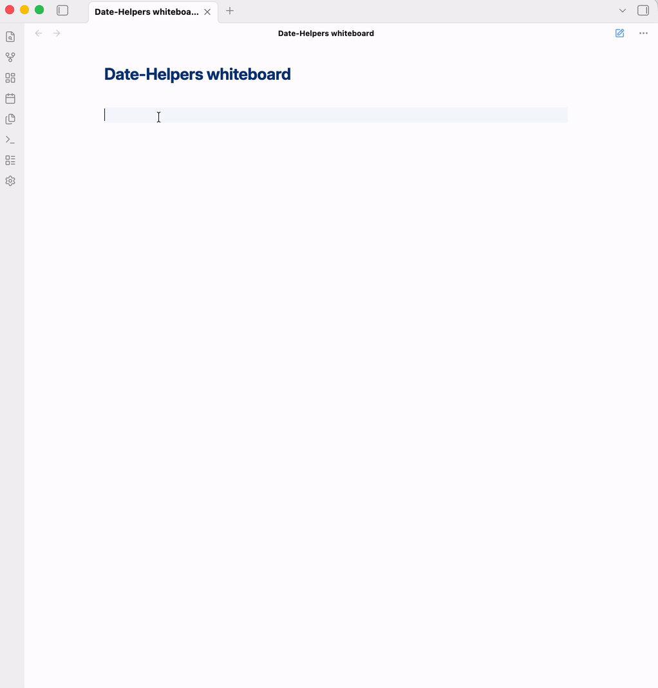
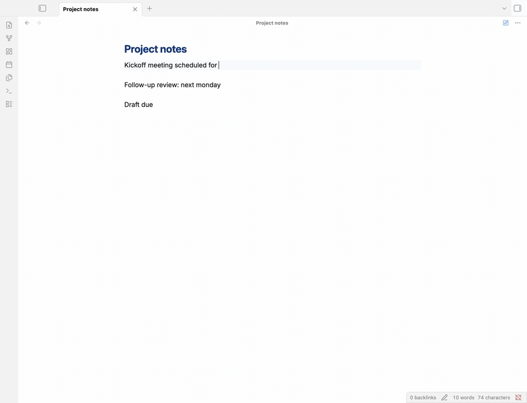

# User Guide

This guide walks you through **Date Helpers** in detail. For a quick overview, see the [README](../README.md).

## Table of contents

1. [Installation](#installation)
2. [Getting started](#getting-started)
3. [Core workflows](#core-workflows)
4. [Natural language parsing](#natural-language-parsing)
5. [Keyboard shortcuts & commands](#keyboard-shortcuts--commands)
6. [Format presets](#format-presets)
7. [Settings reference](#settings-reference)
8. [Integrations](#integrations)
9. [Troubleshooting & FAQ](#troubleshooting--faq)

---

## Installation

### Community Plugins (recommended)

1. Open **Settings → Community Plugins** and disable Safe Mode if needed.
2. Click **Browse** and search for `Date Helpers`.
3. Click **Install**, then **Enable**.

### BRAT (beta testing)

1. Install the [BRAT plugin](https://github.com/TfTHacker/obsidian42-brat).
2. In BRAT, add the beta plugin: `patrice-bour/obsidian-date-helpers`.
3. Enable **Date Helpers** in **Settings → Community Plugins**.

### Manual installation

1. Download `main.js`, `manifest.json`, and `styles.css` from the [latest release](https://github.com/patrice-bour/obsidian-date-helpers/releases).
2. Create the folder `.obsidian/plugins/date-helpers/` in your vault.
3. Copy the three files into that folder.
4. Reload Obsidian and enable the plugin in **Settings → Community Plugins**.

Date Helpers requires **Obsidian 1.13.0 or later**. Earlier versions are served 0.1.2 by the community store.

---

## Getting started

There are two ways to open the date picker:

- **Trigger character**: type `@@` anywhere in a note. The trigger is replaced by whatever you insert.
- **Command palette**: press `Cmd/Ctrl+P` and search for `Date Helpers`.

The plugin registers **no default keyboard shortcuts** — Obsidian's community plugin policy leaves the choice to you. Assign your own in **Settings → Hotkeys**, filtering on `Date Helpers`.

The picker opens a calendar modal with a natural-language field and a format selector. Navigate with the keyboard, press `Enter` to confirm, `Escape` to cancel.

---

## Core workflows

### 1. Insert a date as plain text

1. Place the cursor where you want the date.
2. Type `@@`, or run **Insert date as text**.
3. Pick a date in the calendar, or type an expression like `next Friday`.
4. Choose a format preset.
5. Press `Enter`.

Result: `2026-04-17`, or `April 17, 2026`, depending on the preset.

The format you pick is remembered, so the next insertion starts from the same one.

### 2. Insert a Daily Note wikilink

1. Type `@@` and switch to the **Link to Daily Note** tab.
2. Pick a date.
3. Press `Enter`.

Result: `[[Journal/2026-04-17|April 17, 2026]]`. The path comes from the core Daily Notes plugin; the alias comes from the preset you choose in the settings.

One alias preset is special: **Original Text** reuses what you typed rather than a formatted date, so `tomorrow` stays `tomorrow` in the link text.

### 3. Open a Daily Note by date

Run **Open daily note**, pick any date, and the plugin opens the matching note — creating it first if **Create Daily Note if missing** is enabled.

### 4. Convert an existing selection

1. Select date-like text in your note (`tomorrow`, `2025-11-11`, `demain`).
2. Run **Convert selection to date**.
3. The picker opens with that date already parsed; confirm to replace the selection.

The command only appears in the palette when text is selected.

### 5. Insert a specific format directly

Every format preset also gets its own command — **Insert date: ISO 8601**, **Insert time: 24-hour**, **Insert datetime: Readable**, and so on. These insert immediately at the cursor, with no modal.

They follow the picker's last used action, which is not obvious: after you last confirmed something from the **Link to Daily Note** or **Open Daily Note** tab, these commands insert a wikilink to today's note rather than plain text, until you use the **Insert as Text** tab again.

These commands are registered when the plugin loads, so **reload the plugin after changing your presets** for the command list to match.

---

## Natural language parsing

The NLP field accepts relative expressions, weekdays and time expressions, and previews the result live as you type. Parsing is powered by [chrono-node](https://github.com/wanasit/chrono).

### Examples by language

| Language | Relative | Weekday | Time |
|---|---|---|---|
| English | `today`, `tomorrow`, `3 days ago`, `in 2 weeks` | `next Monday`, `last Friday`, `this Wednesday` | `tomorrow at 2pm`, `Monday 14:30` |
| French | `aujourd'hui`, `demain`, `il y a 3 jours`, `dans 2 semaines` | `lundi prochain`, `vendredi dernier` | `demain à 14h`, `lundi à 14h30` |
| German | `heute`, `morgen`, `vor 3 Tagen` | `nächsten Montag`, `letzten Freitag` | `morgen um 14 Uhr` |
| Japanese | Basic, via chrono-node | | |
| Portuguese | Basic, via chrono-node | | |
| Dutch | Basic, via chrono-node | | |

All six languages are always available — there is no per-language toggle. Coverage beyond English, French and German is whatever chrono-node provides; the plugin adds nothing on top.

**Auto-detect language** does not replace your locale, it extends it: the language of your locale is tried first, and the other five only if that yields nothing. With it off, only your locale's language is tried — so if your locale is not one of the six, leave auto-detect on, or nothing will parse at all.

### Parsing modes

**Parsing mode** switches chrono between two behaviours:

- **Casual** (default) — lenient. Accepts partial or ambiguous expressions and picks the most likely reading.
- **Strict** — conservative. Rejects anything it cannot parse unambiguously.

### When an expression cannot be parsed

Your text is left untouched — the plugin never replaces input it did not understand.

**Convert selection to date** is the exception to the silence: it always shows a notice, whether it parsed the selection or not.

---

## Keyboard shortcuts & commands

### Date picker navigation

| Key | Action |
|---|---|
| `←` `→` | Previous / next day |
| `↑` `↓` | Previous / next week |
| `PageUp` / `PageDown` | Previous / next month |
| `Mod + ↑` / `Mod + ↓` | Previous / next month |
| `Mod + ←` / `Mod + →` | Previous / next year |
| `Home` | Jump to today |
| `t` | Jump to today, from the calendar |
| `Enter` | Confirm |
| `Escape` | Cancel |

`Mod` is `Cmd` on macOS and `Ctrl` elsewhere. There are no confirm or cancel buttons: the footer holds the format selector and a **Today** button, and you confirm with `Enter` or a click on a day.

### Commands

| Command | Available |
|---|---|
| **Insert date as text** | With a note open in the editor |
| **Insert daily note link** | With a note open in the editor |
| **Open daily note** | With a note open in the editor |
| **Convert selection to date** | With a note open and text selected |
| **Insert date: …**, **Insert time: …**, **Insert datetime: …** | One per format preset |

In the palette they are prefixed with the plugin name — `Date Helpers: Insert date: ISO 8601`.

The plugin ships no default shortcut. Assign your own under **Settings → Hotkeys**.

---

## Format presets

Eleven presets ship with the plugin. Examples are rendered for 2 November 2025, 14:30:45, in an English locale — locale-aware presets follow your **Locale** setting.

| Type | Preset | Example |
|---|---|---|
| Date | ISO 8601 | `2025-11-02` |
| Date | Locale short | `11/2/2025` |
| Date | Locale long | `November 2, 2025` |
| Date | Verbose | `Sunday 2 November 2025` |
| Date | Short month | `Nov 2, 2025` |
| Time | 24-hour | `14:30` |
| Time | 12-hour | `2:30 PM` |
| Time | 24-hour with seconds | `14:30:45` |
| DateTime | ISO datetime | `2025-11-02T14:30:45` |
| DateTime | Readable | `Nov 2, 2025 14:30` |
| DateTime | Standard | `2025-11-02 14:30:45` |

Presets are read-only in this version: the settings tab lists them so you can see what each one produces. Custom presets are not implemented yet.

Preset names and descriptions follow your **Locale** too — the table above shows the English
names. The names above appear in the command palette as `Insert date: ISO 8601`; in French
the same command reads `Insérer une date : ISO 8601`, after a plugin reload.

---

## Settings reference

Open **Settings → Date Helpers**. Every setting is indexed by Obsidian's settings search since 0.1.3, so you can also find it by name from the search field.

The tab renders its groups in this order: **Daily Note Link Settings**, **Text Insertion Settings**, **General Settings**, **Features**, **Trigger Characters**, and a read-only list of the format presets.

### General Settings

| Setting | What it does |
|---|---|
| **Locale** | Language and region for date formatting (`en`, `fr`, `fr-CA`, …). Leave empty to follow Obsidian. It also sets the language of the plugin's own interface — settings, picker, preset names and messages — which ships in English and French. |
| **Week starts on** | First column of the calendar. Independent of the locale. |

Format examples in the settings re-render as soon as you change the locale, and so does
every other surface — the picker, the preset names, the notices.

**Command names are the exception.** Obsidian fixes a command's name when the plugin
registers it and offers no way to rename it afterwards, so the command palette keeps the
previous language until you reload the plugin (disable and re-enable it in **Settings →
Community plugins**, or restart Obsidian).

### Features

| Setting | What it does |
|---|---|
| **Enable date picker** | Shows the calendar picker. Turning it off leaves the commands working. |
| **Enable natural language parsing** | Parses expressions such as `tomorrow` or `next Monday`. |
| **Auto-detect language** | Detects the language of each expression instead of using your locale. |
| **Parsing mode** | Casual or Strict, see [above](#parsing-modes). |
| **Show parsing warning** | Currently has no effect — the setting is stored but never read. Your text is preserved either way. |

### Text Insertion Settings

**Default date format** is the preset the picker starts from for *Insert as Text*, and what the format selector remembers between insertions. **Default time format** and **Default datetime format** are currently inert: each preset command carries its own preset, and nothing else reads these two.

### Daily Note Link Settings

| Setting | What it does |
|---|---|
| **Format (with text)** | Alias preset used when the picker has natural-language text to reuse. |
| **Format (no text)** | Alias preset used otherwise. |
| **Create Daily Note if missing** | Creates the note from your Daily Notes template when it does not exist. |

The note's folder and filename format are **not** plugin settings — they come from the core Daily Notes plugin.

### Trigger Characters

The list of sequences that open the picker, `@@` by default. Add one with **+**, remove one with the delete button on its row or the `Delete`/`Backspace` shortcut. At least one trigger always remains.

---

## Integrations

### Daily Notes (core plugin)

Date Helpers reads the folder and filename format from the core Daily Notes plugin, so the wikilinks it inserts resolve like the ones you write by hand.

### Tasks

Inserted dates are plain ISO or locale strings, which the [Tasks](https://github.com/obsidian-tasks-group/obsidian-tasks) plugin parses natively in task lines. Use the ISO 8601 preset for due dates.

### Dataview

Formatted dates work with Dataview's date parsing. Prefer ISO 8601 in DataviewJS, where parsing is strictest.

### Templater

Date Helpers exposes Obsidian commands, so a Templater template can invoke them through `app.commands.executeCommandById()` — for example `date-helpers:insert-date-iso8601`. Commands that open the picker wait for your confirmation, which makes them a poor fit for unattended templates; the preset commands, which insert straight away, work better.

---

## Troubleshooting & FAQ

**Natural language parsing doesn't work.**
Check that **Enable natural language parsing** is on. If your expression is in a language other than your locale, turn on **Auto-detect language**. If it is a partial expression, **Parsing mode** may be set to Strict.

**The date picker doesn't open when I type `@@`.**
Verify **Enable date picker** is on, and that no other plugin intercepts the sequence. You can add a different trigger with **+** and delete the one that clashes — as long as one remains — or ignore the trigger entirely and use the command palette.

**My preset commands don't match my presets.**
Preset commands are registered when the plugin loads. Reload the plugin after changing presets.

**Wrong week start day.**
Change **Week starts on** in the plugin settings. It is independent of your locale.

**Daily Notes links are broken.**
Make sure the core Daily Notes plugin is enabled: the folder and filename format come from it, not from Date Helpers.

**The format selector is missing.**
It appears in **Insert as Text** and **Link to Daily Note**. The **Open Daily Note** tab hides it, since opening a note needs no format.

**I want a custom format preset.**
Not implemented yet. Tell us which format you need in [Discussions](https://github.com/patrice-bour/obsidian-date-helpers/discussions).

---

## More help

- [Issues](https://github.com/patrice-bour/obsidian-date-helpers/issues) for bug reports
- [Discussions](https://github.com/patrice-bour/obsidian-date-helpers/discussions) for questions and feature requests
