# User Guide

You know the date you mean — *next Tuesday*, *three weeks from now* — but writing it down means a detour: counting the days on a mental calendar, typing the result in the right format, or spelling out `[[Journal/2026-08-17|kickoff meeting]]` with brackets, pipe and all.

**Date Helpers** spares you the detour. Type `@tomorrow`, press `Enter`, and the plugin writes the date — as plain text in the format you chose, or as a link to that day's daily note. It reads what you type in six languages, three of them partially.

Your mental calendar can stand down.

This guide covers every workflow and every setting. For a quick overview, see the [README](../README.md).

## Table of contents

1. [Installation](#installation)
2. [Getting started](#getting-started)
3. [Core workflows](#core-workflows)
   1. [Insert a date as you type](#1-insert-a-date-as-you-type)
   2. [Insert a date as plain text](#2-insert-a-date-as-plain-text)
   3. [Insert a daily note wikilink](#3-insert-a-daily-note-wikilink)
      - [The alias field](#the-alias-field)
   4. [Open a daily note by date](#4-open-a-daily-note-by-date)
   5. [Turn a selection into a link](#5-turn-a-selection-into-a-link)
   6. [Insert a specific format directly](#6-insert-a-specific-format-directly)
4. [Natural language parsing](#natural-language-parsing)
   - [Examples by language](#examples-by-language)
   - [Parsing modes](#parsing-modes)
   - [When an expression cannot be parsed](#when-an-expression-cannot-be-parsed)
5. [Keyboard shortcuts & commands](#keyboard-shortcuts--commands)
6. [Format presets](#format-presets)
7. [Settings reference](#settings-reference)
   - [Daily note link settings](#daily-note-link-settings)
   - [Text insertion settings](#text-insertion-settings)
   - [General settings](#general-settings)
   - [Features](#features)
   - [Trigger characters](#trigger-characters)
8. [Integrations](#integrations)
9. [Troubleshooting & FAQ](#troubleshooting--faq)
   - [Natural language parsing doesn't work](#natural-language-parsing-doesnt-work)
   - [The date picker doesn't open when I type the trigger](#the-date-picker-doesnt-open-when-i-type-the-trigger)
   - [Typing an email address opens a popup](#typing-an-email-address-opens-a-popup)
   - [The inline popup lists nothing but one entry](#the-inline-popup-lists-nothing-but-one-entry)
   - [Nothing happens when I type my trigger on an AZERTY keyboard](#nothing-happens-when-i-type-my-trigger-on-an-azerty-keyboard)
   - [The trigger replaced my selected text](#the-trigger-replaced-my-selected-text)
   - [My preset commands don't match my presets](#my-preset-commands-dont-match-my-presets)
   - [Wrong week start day](#wrong-week-start-day)
   - [Clearing the Locale field fills it back with `auto`](#clearing-the-locale-field-fills-it-back-with-auto)
   - [Daily Notes links are broken](#daily-notes-links-are-broken)
   - [The format selector is missing](#the-format-selector-is-missing)
   - [I want a custom format preset](#i-want-a-custom-format-preset)
10. [Prior art](#prior-art)
11. [More help](#more-help)

---

## Installation

### Community Plugins (recommended)

1. Open **Settings → Community Plugins** and disable Safe Mode if needed.
2. Click **Browse** and search for `Date Helpers`.
3. Click **Install**, then **Enable**.

### BRAT (beta testing)

1. Install the [BRAT plugin](https://github.com/TfTHacker/obsidian42-brat).
2. In BRAT, add the beta plugin: `https://github.com/patrice-bour/obsidian-date-helpers`. Its field reads *Paste the link to the repository here*, and the short `patrice-bour/obsidian-date-helpers` works just as well.
3. Enable **Date Helpers** in **Settings → Community Plugins**.

### Manual installation

1. Download `main.js`, `manifest.json`, and `styles.css` from the [latest release](https://github.com/patrice-bour/obsidian-date-helpers/releases).
2. Create the folder `.obsidian/plugins/date-helpers/` in your vault.
3. Copy the three files into that folder.
4. Reload Obsidian and enable the plugin in **Settings → Community Plugins**.

Date Helpers requires **Obsidian 1.13.0 or later** — its settings tab is rendered through the declarative settings API introduced in 1.13.0. Earlier versions are served 0.1.2 by the community store; updating Obsidian gives you the version this guide describes.

---

## Getting started

Three ways in:


*Typing `@` then an expression: the popup reparses on every keystroke and lists what it can insert.*

<br>

- **Inline suggestion**: type `@` and keep typing. What follows is parsed as you go and the popup lists what it can insert — `Enter` inserts the highlighted entry, `Esc` dismisses it, and `Tab` hands your expression over to the full picker. `Space` is an ordinary character here, so `@next monday at 2pm` works. This corresponds to [workflow 1](#1-insert-a-date-as-you-type).
- **Trigger character**: type `@@` in a note to open the full picker. The trigger is replaced by whatever you insert.
- **Command palette**: press `Cmd/Ctrl+P` and search for `Date Helpers`.

`@` and `@@` are just the defaults. Each trigger carries a **mode** saying which of the two it opens, and you can change it, rename the sequence, or add your own — see [Trigger characters](#trigger-characters). The length of a sequence has no bearing on what it opens.

Neither trigger fires in the middle of a word: `any.pattern@` keeps its `@`, and so does any trigger typed right after a letter or a digit.

The plugin registers **no default keyboard shortcuts** — Obsidian's community plugin policy leaves the choice to you. Assign your own in **Settings → Hotkeys**, filtering on `Date Helpers`.

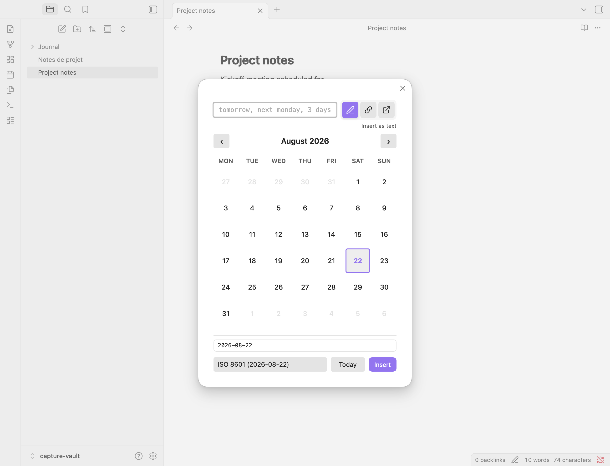
*The picker: the expression field and three action icons on top, the calendar below, the footer underneath.*

<br>

The picker leads with your expression: a full-width natural-language field sits on top, and the three icon buttons beside it choose what confirming does — insert as text, link to a daily note, or open the note. Hover one for its name. The calendar sits below, and the footer stacks, in order: the [alias field](#the-alias-field) when there is text to reuse, the format selector — absent on **Open daily note** — and the **Today** and **Insert** buttons; on **Open daily note**, a read-only line names the day that confirming would open, as `Open: August 26, 2026`. Navigate with the keyboard, press `Enter` to confirm, `Escape` to cancel.

---

## Core workflows

### 1. Insert a date as you type

1. Type `@`, then the date you mean: `@tomorrow`, `@next monday at 2pm` — spaces are ordinary characters here.
2. The popup reparses on every keystroke and lists what it can insert: the date formats you pinned — a datetime format only when your expression names a time — and a link to that day's daily note carrying your words as its alias. A header above the list shows the date it resolved next to what you typed, and a footer bar recalls the keys — `↵` to insert, `Esc` to cancel — and offers **Open the picker…**, on `Tab` or on a click, if you would rather see a calendar.
3. Press `Enter` on an entry.

Result: the whole `@` expression is replaced by the entry you confirmed — a formatted date, or a daily note wikilink. One undo restores what you typed, however long it was. `Esc` dismisses the popup and leaves your text in the note; `Tab` opens the picker instead, carrying your expression.

When your expression reads as no date, the popup does not go blank — it lists exactly one entry: a daily note link carrying what you typed as its alias, with **Open the picker…** still in the footer bar. The plain formats are left out on purpose, since they cannot carry your words.

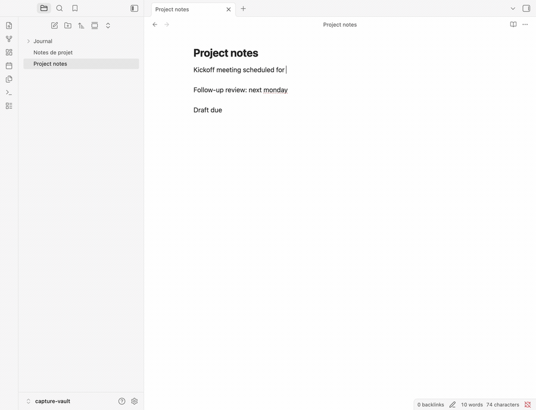
*Typing an expression that parses to no date: the popup keeps the daily note link and the footer still offers the picker. Confirming writes the link, with your words as its alias.*

<br>

**Open the picker…** opens the full picker with your expression carried into its natural-language field, so nothing is retyped.

Which formats the popup lists is yours to choose: each date and datetime preset — eight of the eleven — carries a **Show in the inline suggestion popup** toggle — see [Format presets](#format-presets).

### 2. Insert a date as plain text

1. Place the cursor where you want the date.
2. Type `@@`, or run **Insert date as text…**.
3. Pick a date in the calendar, or type an expression like `next Friday`.
4. Choose a [format preset](#format-presets) — the selector offers the five date presets.
5. Press `Enter`.

Result: `2026-08-26` with the ISO preset, or `Wednesday 26 August 2026` with the verbose one — the animation below picks the second.


*Typing `@@` opens the picker; confirming replaces the trigger with the date.*

<br>

The format you pick is remembered, so the next insertion starts from the same one.


*The format selector reopens on the last format used.*

### 3. Insert a daily note wikilink

1. Type `@@` and switch to the **Link to daily note** action — the link icon.
2. Pick a date.
3. Press `Enter`.

Result: `[[Journal/2026-04-17|April 17, 2026]]`. The path comes from the core Daily Notes plugin; the alias comes from the preset you choose in the settings.

Every option in the format selector shows the output it would write — for the daily note link, the wikilink itself, a long alias shortened on a word boundary. Two of those options are not formats at all: they reuse your own words rather than a formatted date, so the option reads `[[Journal/2026-04-17|tomorrow]]` and `tomorrow` stays `tomorrow` in the link text. Each is listed only while it has text — the selection you opened the picker with, and whatever you type in the natural-language field — and the selection comes pre-selected when there is one. The settings still call these two sources by name, **Selected text** and **Typed text**, under [Format (with text)](#daily-note-link-settings). Reusing a selection this way is [workflow 5](#5-turn-a-selection-into-a-link), animation included.

#### The alias field

**The alias is yours to edit.** On the **Link to daily note** action, the footer carries an **Alias** field: the text it holds is the text the wikilink gets, and you can rewrite it freely — it is your word on the day you are confirming, not tied to the date your expression parsed. Choose an output that does not use the alias — a plain date preset — and the field greys out but keeps your text; choose an alias output again and it comes back, edits included. The captured selection is not consumed either: it survives your detours. On the other actions, and when there is neither a selection nor typed text, the field is simply absent — type an expression and it appears. A long alias scrolls inside the field; the footer keeps its height.

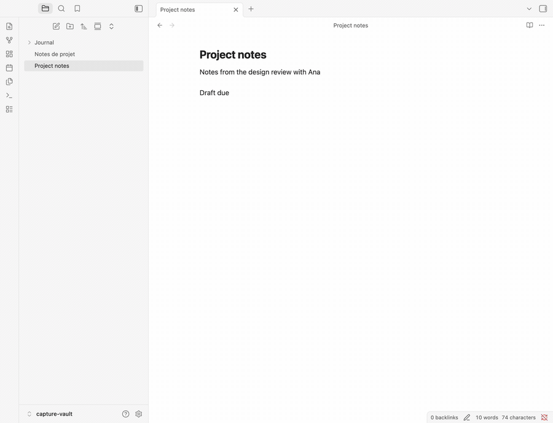
*Trimming the alias, then switching to a plain date preset: the field greys out but keeps your text, and choosing an alias output again brings it back, edit included. Confirming writes the link with the trimmed alias.*

### 4. Open a daily note by date

Run **Open daily note…** and pick any date in the calendar. While you browse, a read-only line in the footer names the day that confirming would open — `Open: August 26, 2026` — and it follows the day you focus.

Result: the matching note opens — picking 17 April 2026 opens the note that `[[Journal/2026-04-17]]` points to, folder and filename following your core Daily Notes settings. If the note does not exist and **Create daily note if missing** is enabled, it is created from your Daily Notes template first.

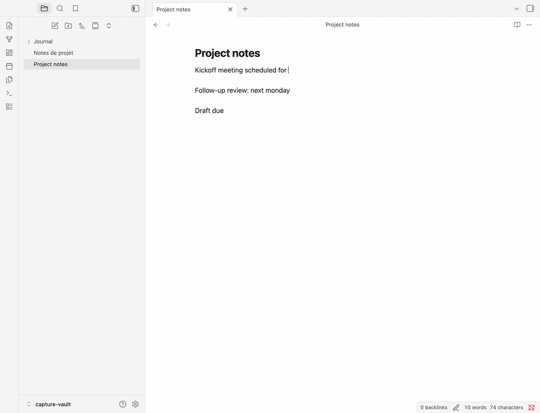
*Running **Open daily note…**: the footer line names the day each arrow key lands on, and confirming opens that day's note.*

### 5. Turn a selection into a link

#### From the command palette

1. Select any text in your note — `next monday`, or `kickoff meeting`.
2. Run **Insert daily note link…**.
3. The picker opens on the daily note link, with your selection already chosen as the alias — the format selector shows the wikilink it would write, `[[Journal/2026-08-17|kickoff meeting]]`. Confirm a date to replace the selection.

Your selection becomes the link's alias whether or not it reads as a date: `[[Journal/2026-08-17|kickoff meeting]]` works exactly like `[[Journal/2026-08-17|next monday]]`. A selection that does parse also decides which day the calendar opens on.

> **Migrating from 0.1.x?**
>
> This workflow replaced the **Convert selection to date** command. Obsidian drops a hotkey bound to a removed command: rebind yours to **Insert daily note link…** under **Settings → Hotkeys**. Details in the [CHANGELOG](../CHANGELOG.md#020---2026-08-19).

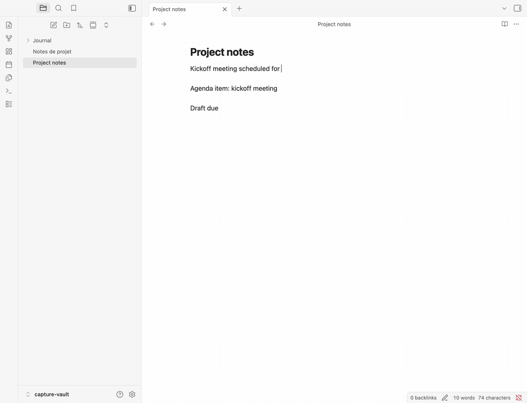
*Selecting "kickoff meeting" and running **Insert daily note link…**: confirming a day writes a wikilink aliased with those words.*

#### By typing a trigger over the selection

You can also type a trigger straight over the selection, without the command palette. The keystroke that would normally replace the selection is called off: your text never moves. The plugin writes the trigger after it, separated by a space, so you see both the text being held and what you type next — which only names the day.


*Selecting "Kickoff meeting", typing `@tomorrow`, and choosing the link entry: the selection stays as the link's alias.*

<br>

A bar above the list says what is going on: the header row carries the resolved date and your query, and under it **selection** names the text being held, with the key that gives it back. `Esc` does more here than dismiss: it takes back exactly what the trigger added — the separating space, the trigger, and anything you typed after it — leaving the line as it read before the keystroke. Backspacing the trigger does the same.

While a selection is held, the **daily note link leads the list** and is the entry `Enter` confirms — it is the only one that carries an alias. The plain formats are still there below it, and confirming one writes the date instead: your selected text is then replaced, and one undo brings it back.

#### With `@@`, the full picker

`@@` behaves the same way: it opens the full picker with your selection already chosen as the alias source, on the **Link to daily note** action — the only one an alias means anything to. Cancelling gives the text back. Opening there does not change the action the picker remembers. Two things do: choosing an action inside the picker — a click is enough, confirmed or not — and running one of the three picker commands, which stamps its action the moment the picker opens, even if you then cancel.

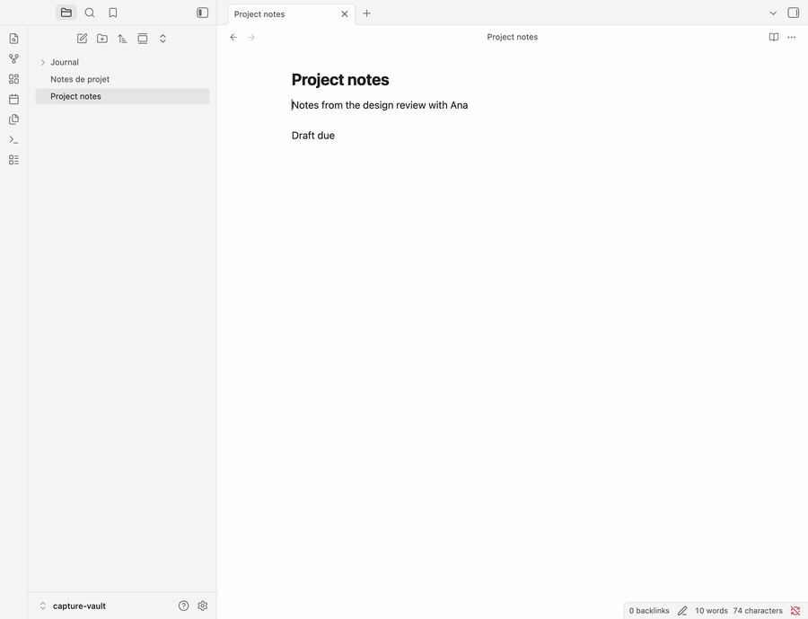
*Typing `@@` over a selection: the picker opens on **Link to daily note** with your words in the alias field. `Tab` reaches that field from the calendar, and the link carries the text you leave there.*

### 6. Insert a specific format directly

Every format preset also gets its own command — **Insert date: ISO 8601**, **Insert time: 24-hour**, **Insert datetime: Readable**, and so on. These insert immediately at the cursor, with no modal.

They follow the picker's last used action, which is not obvious: once the picker last stood on **Link to daily note** or **Open daily note**, these commands insert a wikilink to today's note rather than plain text, until the picker stands on **Insert as text** again.

These commands are registered when the plugin loads, so **reload the plugin after changing your presets** for the command list to match.

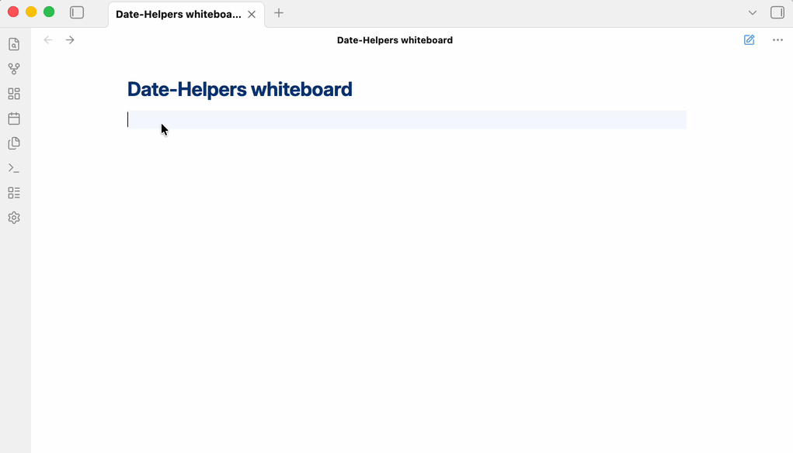
*Running **Insert date: ISO 8601** from the palette inserts at the cursor, with no modal.*

<br>

---

## Natural language parsing

The NLP field accepts relative expressions, weekdays and time expressions, and previews the result live as you type. Parsing is powered by [chrono-node](https://github.com/wanasit/chrono).

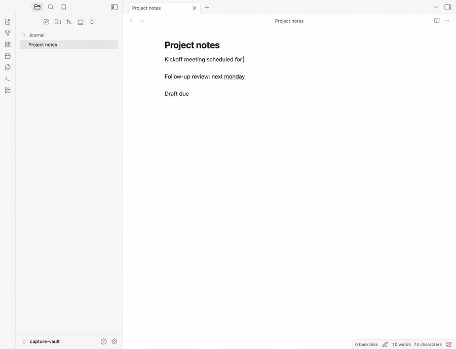
*Typing "next month" updates the preview and moves the calendar.*

### Examples by language

Three languages have full coverage:

| Language | Relative | Weekday | Time |
|---|---|---|---|
| English | `today`, `tomorrow`, `3 days ago`, `in 2 weeks`, `the day after tomorrow` | `next Monday`, `last Friday`, `this Wednesday` | `tomorrow at 2pm`, `Monday 14:30` |
| French | `aujourd'hui`, `demain`, `il y a 3 jours`, `dans 2 semaines`, `avant-hier`, `après-demain` | `lundi prochain`, `vendredi dernier` | `demain à 14h`, `lundi à 14h30` |
| German | `heute`, `morgen`, `vor 3 Tagen`, `vorgestern`, `übermorgen` | `nächsten Montag`, `letzten Freitag` | `morgen um 14 Uhr` |

**Japanese, Portuguese and Dutch** are read through chrono-node's basic coverage — a table of them would be mostly empty cells, so here it is in words instead. The plugin itself adds the compound days: `一昨日` and `一昨昨日` in Japanese, `antes de ontem` and `depois de amanhã` in Portuguese; Dutch has no extras yet. One limit worth knowing: Portuguese and Japanese ignore the `next`/`last` modifier and do not read `in N days` — `sexta-feira passada` gives you whichever Friday is nearest, which may be the wrong one. On those two, prefer the calendar for a past or future week.

Coverage in these languages is whatever chrono-node provides: type your expression in the NLP field and the live preview answers immediately, one way or the other.

One nuance: the compound day expressions above (`avant-hier`, `après-demain`, `antes de ontem`, `depois de amanhã`, `一昨日`, `一昨昨日`, and English `the day after tomorrow`) are parsed by the plugin itself, so `après-demain` lands two days ahead instead of being read as `demain` — and `一昨昨日` reaches **three** days back, one more than `一昨日`.

**Compound days it does not know yet.** `surlendemain` and `avant-veille` in French, `anteontem` in Portuguese, `おととい`, `明後日` and `あさって` in Japanese, and both Dutch forms — `eergisteren`, `overmorgen` — parse to nothing. Watch what the popup does then: it falls back to **today**, so its one remaining entry is a link to today's daily note carrying your words as the alias — confirm it and `overmorgen` links a day two days off the one you meant. Dismiss instead, and write `dans 2 jours` or `il y a 2 jours`.

**Auto-detect language** decides which of the six languages are tried — there is no per-language toggle. It does not replace your locale, it extends it: the language of your locale is tried first, and the other five only if that yields nothing. With it off, only your locale's language is tried — so if your locale is not one of the six, leave auto-detect on, or nothing will parse at all.

### Parsing modes

**Parsing mode** switches chrono between two behaviours:

- **Casual** (default) — lenient. Accepts partial or ambiguous expressions and picks the most likely reading.
- **Strict** — conservative. Rejects anything it cannot parse unambiguously.

The difference shows on everyday expressions: in French, `demain` parses in Casual and is rejected in Strict — while `après-demain`, handled by the plugin's own compound parser, resolves in both modes. The picker's preview is the quickest way to see where a given expression falls: type it in the natural-language field, and the preview either updates with a date or reads **Could not parse date**. Switch **Parsing mode** in the settings and try the same expression again.

### When an expression cannot be parsed

No formatted date is invented: an expression that reads as no date never becomes one of the plain formats, and dismissing the popup or the picker leaves your words as you typed them.

Nor is unparsed text an error. In the `@` popup and over a selection, it is offered as the daily note link's alias — confirming does replace the expression with the wikilink, but the wikilink carries your words forward as its alias, so nothing you wrote is discarded.

---

## Keyboard shortcuts & commands

### Date picker navigation

| Key | Action |
|---|---|
| `←` `→` | Previous / next day |
| `↑` `↓` | Previous / next week |
| `PageUp` / `PageDown` | Previous / next month |
| `Mod + ↑` / `Mod + ↓` | Previous / next month |
| `Mod + ←` / `Mod + →` | Previous / next year |
| `Home` | Jump to today |
| `t` | Jump to today, from the calendar |
| `Enter` | Confirm |
| `Escape` | Cancel |

`Mod` is `Cmd` on macOS and `Ctrl` elsewhere. The footer holds, in order: the [alias field](#the-alias-field) when there is text to carry, the format selector — absent on **Open daily note** — and the **Today** and **Insert** buttons; on **Open daily note**, a read-only line names the day that confirming would open, following the focused day. You confirm with `Enter`, a click on a day, or **Insert**. There is no cancel button — `Escape` closes.

**Two fields take precedence over these keys.** While the natural-language field holds text, the arrows, `Home`, `PageUp`/`PageDown` and the `Mod` combinations edit or move through your text rather than the calendar — empty the field and the calendar answers again. `t` steps aside as soon as the field has focus, text or no text: `today`, `tomorrow` and `thursday` all start with it. And the alias field claims every navigation key while it has the focus, even empty.


*Arrows move the day, `PageDown` changes month, `t` returns to today, `Enter` confirms.*

### Commands

| Command | Available |
|---|---|
| **Insert date as text…** | With a note open in the editor |
| **Insert daily note link…** | With a note open in the editor |
| **Open daily note…** | With a note open in the editor |
| **Insert date: …**, **Insert time: …**, **Insert datetime: …** | One per format preset |

In the palette they are prefixed with the plugin name — `Date Helpers: Insert date: ISO 8601`.

The three ellipses are literal: each opens the picker rather than inserting anything on its own.

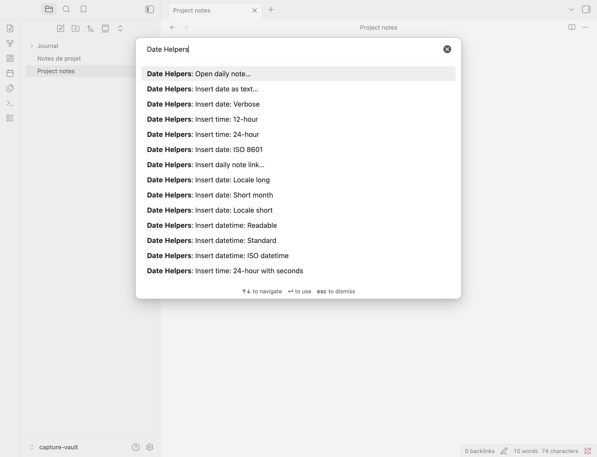
*Filtering the command palette on `Date Helpers` lists every command the plugin registers.*

<br>

The plugin ships no default shortcut. Assign your own under **Settings → Hotkeys**.

---

## Format presets

Eleven presets ship with the plugin. Examples are rendered for 2 November 2025, 14:30:45, in an English locale — locale-aware presets follow your **Locale** setting.

| Type | Preset | Example |
|---|---|---|
| Date | ISO 8601 | `2025-11-02` |
| Date | Locale short | `11/2/2025` |
| Date | Locale long | `November 2, 2025` |
| Date | Verbose | `Sunday 2 November 2025` |
| Date | Short month | `Nov 2, 2025` |
| Time | 24-hour | `14:30` |
| Time | 12-hour | `2:30 PM` |
| Time | 24-hour with seconds | `14:30:45` |
| DateTime | ISO datetime | `2025-11-02T14:30:45` |
| DateTime | Readable | `Nov 2, 2025 14:30` |
| DateTime | Standard | `2025-11-02 14:30:45` |

In the picker, the format selector draws on the five date presets only. Time and datetime presets insert through their own commands — and the datetime ones can surface in the `@` popup when your expression names a time.

The formats themselves are read-only in this version: the settings tab lists each preset so you can see what it produces, and the one control a row carries is the **Show in the inline suggestion popup** toggle, on the date and datetime rows. Custom presets are not implemented yet — if you need a format the eleven do not cover, say so in [Discussions](https://github.com/patrice-bour/obsidian-date-helpers/discussions).

Preset names and descriptions follow your **Locale** too — the table above shows the English names. The names above appear in the command palette as `Insert date: ISO 8601`; in French the same command reads `Insérer une date : ISO 8601`, after a plugin reload.

---

## Settings reference

Open **Settings → Date Helpers**. The named settings are indexed by Obsidian's settings search, so you can also find them from the search field. The format preset list at the bottom of the tab is the exception: its rows, **Show in the inline suggestion popup** toggles included, do not appear in search results — scroll to them instead.

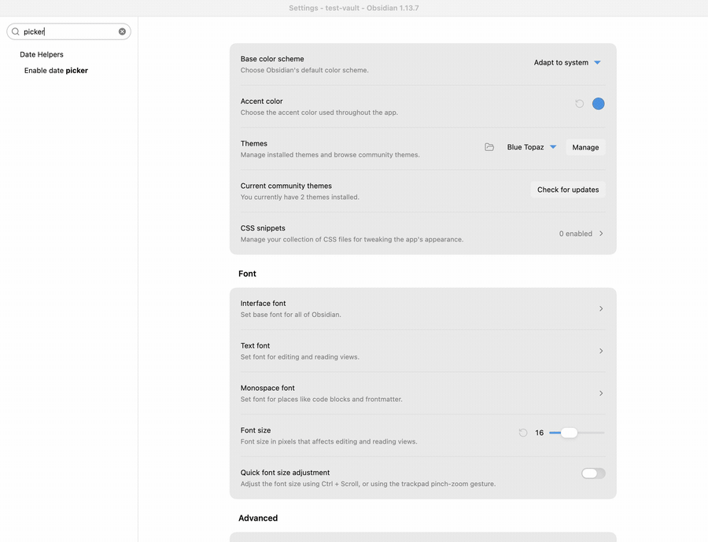
*Searching "picker" in Obsidian's settings search finds the Date Helpers setting.*

<br>

The tab renders its groups in this order — the same order this section follows: **Daily note link settings**, **Text insertion settings**, **General settings**, **Features**, **Trigger characters**, and the list of format presets.

### Daily note link settings

| Setting | What it does |
|---|---|
| **Format (with text)** | Alias used when the picker has text to reuse. **Selected text** and **Typed text** are listed first: they reuse your own words rather than a formatted date. In the picker itself, you will recognize them by the wikilink they would write, not by these names. |
| **Format (no text)** | Alias preset used otherwise. Text sources are not offered here — there would be no text behind them. |
| **Create daily note if missing** | Creates the note from your Daily Notes template when it does not exist. |

The note's folder and filename format are **not** plugin settings — they come from the core Daily Notes plugin.

### Text insertion settings

**Default date format** is the preset the picker starts from for *Insert as text*, and what the format selector remembers between insertions. There is no equivalent for time or datetime: each preset command carries its own preset.

### General settings

| Setting | What it does |
|---|---|
| **Locale** | Language and region for date formatting (`en`, `fr`, `fr-CA`, …). Leave empty to follow Obsidian. It also sets the language of the plugin's own interface — settings, picker, preset names and messages — which ships in English and French. |
| **Week starts on** | First column of the calendar. Independent of the locale. |

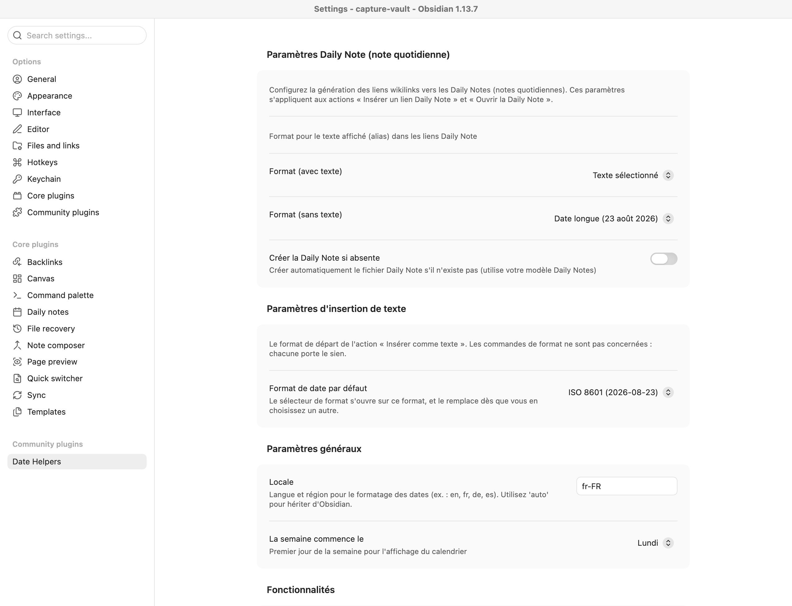
*Setting **Locale** to French: the plugin's settings speak French, Obsidian around them stays in English.*

<br>

The screenshot above shows the setting's exact scope: **Locale** governs the plugin's own surfaces, so its settings speak French while Obsidian's interface around them keeps speaking English — the two are independent.

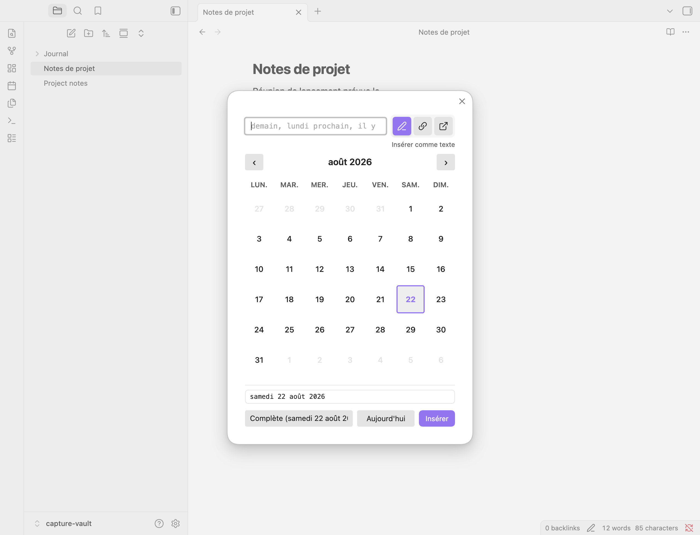
*The picker in French: the status row, calendar and footer follow the Locale setting.*

<br>

Format examples in the settings re-render as soon as you change the locale, and so does every other surface — the picker, the preset names, the notices.

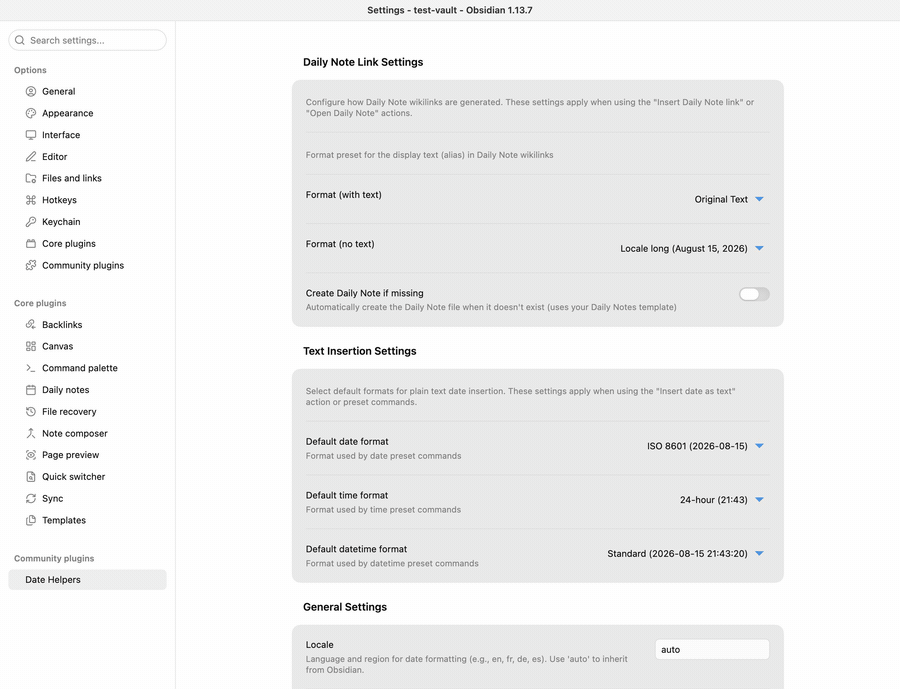
*Typing `fr-FR` in **Locale** re-renders the tab in French, examples included.*

<br>

**Command names are the exception.** Obsidian fixes a command's name when the plugin registers it and offers no way to rename it afterwards, so the command palette keeps the previous language until you reload the plugin (disable and re-enable it in **Settings → Community plugins**, or restart Obsidian).

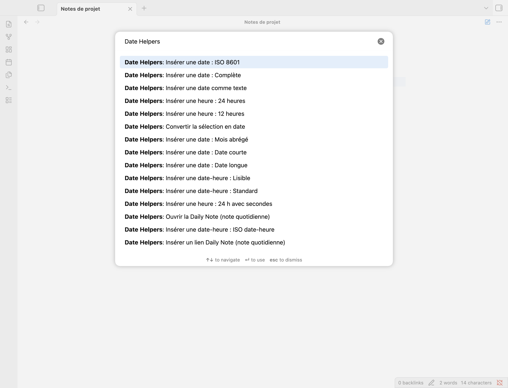
*Reloading the plugin brings the command palette over to French too.*

### Features

| Setting | What it does |
|---|---|
| **Enable date picker** | One switch, two surfaces, despite its name: it governs the triggers you type in a note — `@@`, `@`, and any you add. Turned off, no trigger fires and the `@` popup is gone; the commands still open the calendar picker. |
| **Enable natural language parsing** | Parses expressions such as `tomorrow` or `next Monday`. |
| **Auto-detect language** | Tries your locale's language first, then the other five when it yields nothing — see [Natural language parsing](#natural-language-parsing). |
| **Parsing mode** | Casual or Strict, see [above](#parsing-modes). |

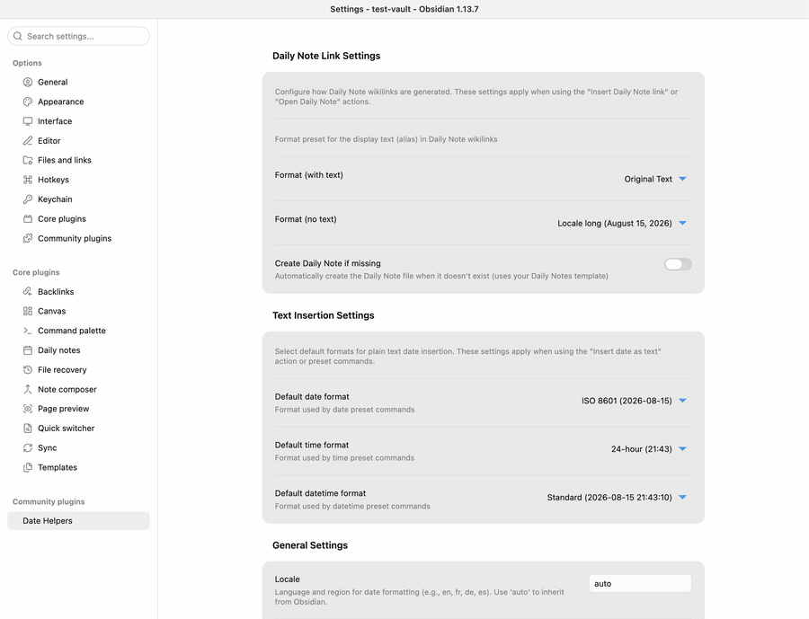
*Turning natural language parsing off hides its two dependent settings.*

<br>

When an expression cannot be parsed, nothing is lost and nothing pops up: the picker's preview says **Could not parse date** and your text stays as you typed it.

### Trigger characters

The list of sequences you can type in a note to insert a date, `@@` and `@` by default. Each row carries an **Opens** control naming what that sequence opens — **Date picker** (the full modal) or **Inline suggestions** (the popup) — and you can change it on any row. Add a trigger with **+**, which asks for both the sequence and its mode; remove one with the delete button on its row or the `Delete`/`Backspace` shortcut. At least one trigger always remains, and a sequence is 5 characters at most.

**Length does not decide the mode.** A one-character `;` can open the picker and a three-character `//d` can open the popup — the combination is yours. Triggers configured under an older version keep exactly the behaviour they had; the [CHANGELOG](../CHANGELOG.md#020---2026-08-19) has the details.

Each date and datetime format also carries a **Show in the inline suggestion popup** toggle in the format list below: it decides which formats the popup offers. The daily note entry is always there, whatever you pin, and the footer's **Open the picker…** action with it.

**On a keyboard where a trigger needs AltGr** — `@` on AZERTY layouts under Windows and Linux — the trigger works: Date Helpers reads AltGr as a typed character. The one thing that can silence it is an Obsidian hotkey bound to `Ctrl+Alt` plus that same character, which wins the keystroke. The FAQ entry [Nothing happens when I type my trigger on an AZERTY keyboard](#nothing-happens-when-i-type-my-trigger-on-an-azerty-keyboard) covers it.

**Reload the plugin after changing this list.** The triggers are read when the plugin loads, so a sequence you add, remove or reassign takes effect on the next reload (`Cmd/Ctrl+R`), not immediately. The **Show in the inline suggestion popup** toggles, by contrast, apply straight away.

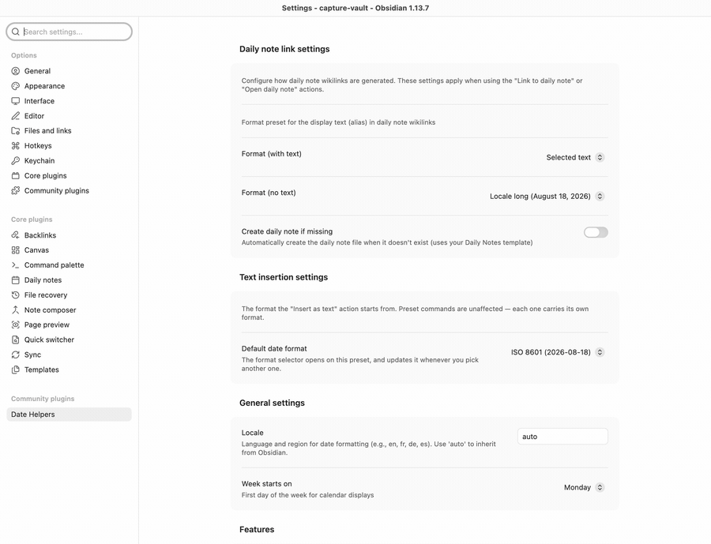
*Adding `//d` with the **+** button, then removing it from its row.*

<br>

---

## Integrations

### Daily Notes (core plugin)

Date Helpers reads the folder and filename format from the core Daily Notes plugin, so the wikilinks it inserts resolve like the ones you write by hand.

### Tasks

Inserted dates are plain ISO or locale strings, which the [Tasks](https://github.com/obsidian-tasks-group/obsidian-tasks) plugin — task lists with due dates — parses natively in task lines. For a due date, place the cursor where the date belongs in the task line and run **Insert date: ISO 8601** — with one glance at [workflow 6](#6-insert-a-specific-format-directly) first: preset commands follow the picker's last used action, so if the picker last stood on a daily note action, the command writes a wikilink to today rather than the ISO date.

### Dataview

Formatted dates work with the date parsing of Dataview, the plugin that runs queries over your notes. Prefer ISO 8601 in DataviewJS, where parsing is strictest. An ISO date inserted at the cursor makes a valid inline field value:

```markdown
deadline:: 2026-08-17
```

Dataview reads that field as a date, so a query can compare it — `WHERE deadline < date(today)`.

### Templater

Date Helpers exposes Obsidian commands, so a template from Templater — the template-scripting plugin — can invoke them through the command API:

```javascript
<%*
app.commands.executeCommandById('date-helpers:insert-date-iso8601');
%>
```

The `<%* … %>` delimiters are Templater's execution block — without them, the line is displayed instead of run. Commands that open the picker wait for your confirmation, which makes them a poor fit for unattended templates; the preset commands, which insert straight away, work better.

---

## Troubleshooting & FAQ

### Natural language parsing doesn't work

Check that **Enable natural language parsing** is on. If your expression is in a language other than your locale, turn on **Auto-detect language**. If it is a partial expression, **Parsing mode** may be set to Strict.

### The date picker doesn't open when I type the trigger

Verify **Enable date picker** is on — it governs every trigger, `@@` included — and that no other plugin intercepts the sequence. You can add a different trigger with **+** and delete the one that clashes — as long as one remains — or ignore the trigger entirely and use the command palette. Either way, reload the plugin afterwards (`Cmd/Ctrl+R`): the trigger list is read when it loads.

### Typing an email address opens a popup

It should not: a trigger placed right after a word character is inert, so `any.pattern@` inserts a plain `@`. If a popup does open there, report it — that is a bug.

### The inline popup lists nothing but one entry

That is what it does when your expression reads as no date: a daily note link carrying what you typed as its alias, with **Open the picker…** still in the footer bar. Plain formats are left out on purpose — they cannot carry your words. [Workflow 1](#1-insert-a-date-as-you-type) shows the exchange, capture included.

### Nothing happens when I type my trigger on an AZERTY keyboard

Check **Settings → Hotkeys** for a shortcut bound to `Ctrl+Alt+@`, from Obsidian or from another plugin. On AZERTY layouts `@` is AltGr+0, which the system reports as ctrl and alt held together, so such a hotkey takes the keystroke first. Rebind it, or give the trigger a different sequence.

If rebinding changes nothing, your plugin version is unlikely to be the culprit: even before 0.2.0 the trigger was read straight from the typed text, so an AltGr-typed `@` fired there too — what those versions broke was the selection under a trigger, not the trigger itself ([CHANGELOG](../CHANGELOG.md#020---2026-08-19)). The current AltGr handling was verified by simulating the keystroke, not on a physical AZERTY keyboard: your confirmation — or your bug report — is welcome in [Discussions](https://github.com/patrice-bour/obsidian-date-helpers/discussions).

### The trigger replaced my selected text

It should not: the keystroke is called off, your text stays in the note and becomes the link's alias — that is [workflow 5](#5-turn-a-selection-into-a-link). If your text was just replaced, one undo brings it back — and it means you are on 0.1.x, where a trigger typed over a selection destroyed it: update the plugin. Details in the [CHANGELOG](../CHANGELOG.md#020---2026-08-19).

### My preset commands don't match my presets

Preset commands are registered when the plugin loads. Reload the plugin after changing presets.

### Wrong week start day

Change **Week starts on** in the plugin settings. It is independent of your locale.

### Clearing the Locale field fills it back with `auto`

An empty field means "follow Obsidian", and that is stored as `auto` — so half a second after you clear it, the field redraws with `auto` in it. The two say the same thing, and nothing was lost. To override Obsidian instead, type a locale code over it (`fr`, `en-GB`, `fr-CA`, …).

### Daily Notes links are broken

Make sure the core Daily Notes plugin is enabled: the folder and filename format come from it, not from Date Helpers.

### The format selector is missing

It appears in **Insert as text** and **Link to daily note**. The **Open daily note** action hides it, since opening a note needs no format.

### I want a custom format preset

Not implemented yet. Tell us which format you need in [Discussions](https://github.com/patrice-bour/obsidian-date-helpers/discussions).

---

## Prior art

The `@` trigger owes its shape to [Natural Language Dates](https://community.obsidian.md/plugins/nldates-obsidian) by Argenos, which has served the Obsidian community for years and showed what date entry in a note could feel like.

Date Helpers pushes elsewhere: six parsing languages rather than one, eleven format presets — the date and datetime ones each carrying a pinning choice for the `@` popup — a translated interface, and a single picker covering text insertion, daily note links and opening the note. If you want a small, focused `@today` and nothing more, nldates is the better fit — and it remains the plugin others build their parsing on.

---

## More help

- [Issues](https://github.com/patrice-bour/obsidian-date-helpers/issues) for bug reports
- [Discussions](https://github.com/patrice-bour/obsidian-date-helpers/discussions) for questions and feature requests
- [CHANGELOG](../CHANGELOG.md) for what changed between releases
